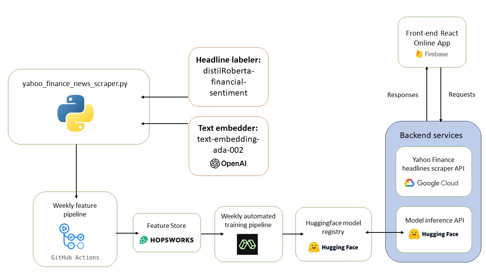

# ID2223-news-sentiment
Project for ID2223

Access to UI: https://news-sentiment-analyzer.web.app/ (currently non-functional because API is terminated)

Developers: Farhad Madadzade & Calin Petrea

Group number: 19

# Project description
This project is a sentiment analysis model for financial news headlines. The model is fine-tuned on the base data [Financial Phrasebank](https://huggingface.co/datasets/financial_phrasebank) dataset and [Zeroshot Twitter](https://huggingface.co/datasets/zeroshot/twitter-financial-news-sentiment). Every week, new features are collected by scraping Yahoo News and getting the sentiment of new news articles. The base model is then fine-tuned again but with the incremented dataset and if the newly fine-tuned model performs better than the prior version, this one is deployed. The model is then used by an app that we built that allows users to enter a search key and a maximum number of articles to analyze. The app then makes a request to the API to fetch the articles related to the search term from the past 7 days. The script in the API that does the scraping is a JavaScript version of the Python script that is used to collect new features every week. Our API is deployed using Google Cloud. The frontend app is deployed using Firebase and can be found on [News Sentiment Analyzer](https://news-sentiment-analyzer.web.app/). The model is deployed to [Huggingface.co](https://huggingface.co/Artanis1551/bert_sentiment_trainer?text=I+like+you.+I+love+you)

# Architecture diagram


# Base dataset description:
Our base dataset was based on two datasets. The first is [Financial Phrasebank](https://huggingface.co/datasets/financial_phrasebank) and the second is [Zeroshot Twitter](https://huggingface.co/datasets/zeroshot/twitter-financial-news-sentiment).
Both datasets essentially include a text as well as a sentiment label. For FinancialPhraseBank it is negative, neutral, and positive, and for Zeroshot bearish, bullish, and neutral.
The financial phrase bank dataset contains 4 subsets created based on how the annotators agreed on the labeling: 50%, 66%, 75%, and 100%. We used the one with 75% agreeance to maximize the size of our final dataset. Preprocessing was required to adapt between the different labeling used by the datasets so they could be combined. Ultimately the labels used by us were negative, positive, and neutral (mapped to 0, 1, and 2 in the feature store on Hopsworks).  

# Base model description:
https://huggingface.co/bert-base-cased
The BERT (Bidirectional Encoder Representations from Transformers) model is a transformers model that has been pre-trained on a large dataset of English data in a self-supervised fashion. It is a base model that has been pre-trained on the raw texts only, with no humans labeling them in any way. The model is case-sensitive. The model was pre-trained with two objectives: masked language modeling (MLM) and next sentence prediction (NSP). The MLM objective involves masking 15% of the words in the input sentence and predicting the masked words. The NSP objective involves concatenating two masked sentences as inputs during pre-training and predicting if the two sentences were following each other or not. The BERT model can be fine-tuned on a downstream task such as sequence classification, token classification, or question answering. The model is primarily aimed at being fine-tuned on tasks that use the whole sentence (potentially masked) to make decisions.
This model was first introduced in this paper https://arxiv.org/pdf/1810.04805.pdf

# Project files and folders:

## sentiment_analysis_backend
This folder contains all the necessary files for the API used by the app. This includes the javascript version of yahoo_finance_news_scraper. The backend is written using the conventions of NodeJs. This API has one endpoint that is used by the front end to get the sentiment of a specific stock. The endpoint is called /sentiment-analysis and takes queries as input. The queries are `searchKey` and `maxArticlesPerSearch`. The `searchKey` is the search term that is used to find the headlines that are related to the stock. The `maxArticlesPerSearch` is the maximum number of headlines that are used to analyze the sentiment of the search term. The endpoint returns a JSON object with the following structure:
```json
{
    "result": [
        {
            "headline": "string",
            "posted": "Date | null",
            "text": "string",
            "href": "string",
        },
    ]
}
```

## sentiment_analysis_frontend
All the files necessary for the front end and using the endpoint from the API as well as the inference API for the model on Huggingface. The front end is written in React, a popular JavaScript library for building user interfaces. It's responsible for displaying data to users and handling user interactions.

## deploy_weekly_training.sh
This is a shell script used for running a script on Modal for retraining the model weekly after new features have been collected. Using modal allows us to automate the process of triggering the training pipeline, ensuring that the model is regularly updated with fresh data.

## feature_pipeline_weekly.py
This is the pipeline script that collects new features weekly by using the `yahoo_finance_news_scraper.py` module. The scraper collects 50 headlines from the past 7 days each of the search keys `AAPL`, `AMZN`, `GOOGL`, `MSFT`, `TSLA`. We then get their sentiment using the model [distilRoberta-financial-sentiment](https://huggingface.co/mrm8488/distilroberta-finetuned-financial-news-sentiment-analysis). In order for us to upload these feaures to Hopsworks we embedd the text for each feature using OpenAI's text embedder model [text-embedding-ada-002](https://huggingface.co/Xenova/text-embedding-ada-002). Once the new features are collected they are split into training and test sets and uploaded to the respective training and test feature groups on Hopsworks. This ensures that the model has a steady stream of new data to learn from.

## feature_pipeline.ipynb
This is the notebook used to upload the initial features from the base dataset. The code is very similar to the weekly feature pipeline script but does not collect features using the scraping script. It is also here that we created the train and test feature groups on Hopsworks. This pipeline was only run once to create and initialize the feature groups.

## hyperparameter_search.ipynb
This is a notebook we used to make a hyperparameter search to find the optimal combination of hyperparameters for when we train the model. The optimal hyperparameter search was found using Optuna as the background to the hyperparameter_search method of the Trainer class from Huggingface. The optimal training arguments which we also end up using are the following:

```python
training_args = TrainingArguments(
    output_dir="bert_sentiment_trainer", 
    evaluation_strategy="steps",
    per_device_train_batch_size=16,
    per_device_eval_batch_size=4,
    num_train_epochs=8,
    learning_rate= 2.754984679344267e-05,
    save_total_limit=3,
    seed=42,
    lr_scheduler_type='constant_with_warmup',
    warmup_steps=50,
    max_steps=3000,
    save_strategy="steps",
    save_steps=250,
    fp16=False,
    eval_steps=250,
    logging_steps=25,
    report_to=["tensorboard"],
    load_best_model_at_end=True,
    metric_for_best_model="accuracy",
    greater_is_better=True,
)
```


## preprocessing_pipeline.ipynb
This notebook was used to preprocess the base data and collect them into csv files (for later use in feature_pipeline.ipynb) as well as figure out and test the text embedding tokenizer to see that it works as intended.

## requirements.txt
The requirements.txt file contains the modules needed to run the Python script.

## training_pipeline.py
This script is run when running the shell script deploy_weekly_training.sh. It collects the training and test features from Hopsworks and runs the finetuning of the bert_base_cased model from Huggingface using the optimal hyperparameters found in the previously mentioned hyperparameter Python notebook. If the fine-tuned model (using the newly incremented data) performs better than the previous version the new model is uploaded to huggingface. This script is the main driver of the model training process.

## training_pipeline_notebook.ipynb
This notebook is similar to the training_pipeline.py script but is in a Python notebook format. In this notebook, we fine-tuned and uploaded the first version of our model to Huggingface. 

## yahoo_finance_news_scraper.py
This module contains the functions necessary to do the scraping on Yahoo News to find the headlines that are related to a specific search term. The script ran into errors when using Python versions higher than 3.10, so we recommend using version 3.9 or 3.8.


# How to run the pipelines
## Run the backend locally
You will need to install node (we used version 18). To run the backend locally on your computer you need to uncomment one line and comment out another. The file is on the file path sentiment_analysis_backend\app.js. Uncomment line 15 and comment out line 14. This is needed so that the requests from the front end are allowed. Change the directory to the sentiment_analysis_backend folder, and run the command
```bash
npm install
npm run dev
```

## Run the frontend locally
You vill need to install node (we used version 18). You also have to create a file in the sentiment_analysis_frontend folder called credentials.json that contains the following:
```json
{
    "huggingface": "<your huggingface API key>"
}
```
To run the frontend locally on your computer you need to uncomment one line and comment out another. The file is on the file path sentiment_analysis_frontend\src\pages\Index.jsx. Uncomment line 130 and comment out line 129. This is needed to be able to use the API you are running locally on your computer. Change the directory to the sentiment_analysis_frontend folder, and run the command
```bash
npm install
npm run dev
```

## Pipelines
All of the pipeline scripts/notebooks can be run by just running them. Make sure that you have the necessary python modules installed by running the command
```bash
pip install -r requirements.txt
``` 
